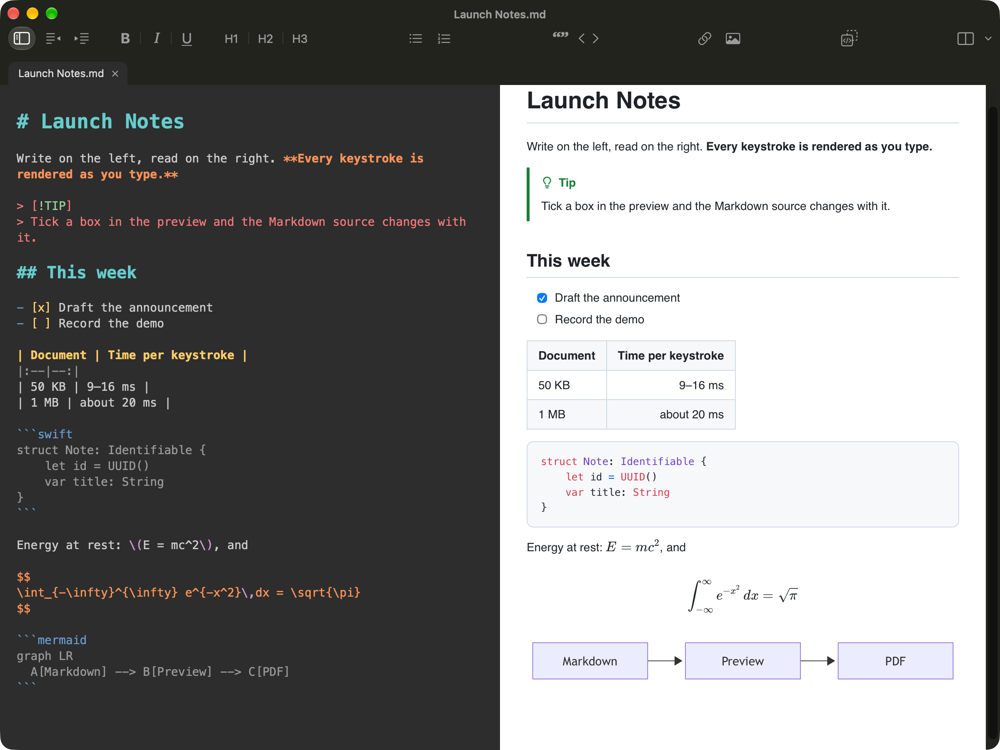
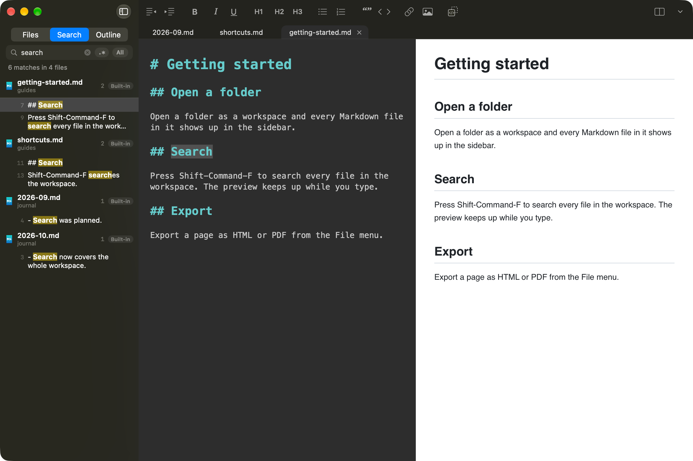

<p align="right"><b>English</b> · <a href="README.zh-CN.md">简体中文</a> · <a href="https://xuanji86.github.io/MacDown2.0/">Website</a></p>

<p align="center">
  
</p>

<h1 align="center">MacDown2.0</h1>

<p align="center"><strong>Markdown, native to the Mac. Rebuilt from zero.</strong></p>

<p align="center">
  <a href="LICENSE"></a>
  
  
  
</p>

<p align="center">
  
</p>

<p align="center"><sub>The default look: a dark editor beside a white page. A GitHub alert, a task list, a table, Swift highlighting, KaTeX and a Mermaid diagram, rendered live.</sub></p>

## Why MacDown2.0

Over a decade ago, Mou (Chen Luo) set the shape of Markdown writing on the Mac: source on the left, a live preview on the right, nothing in between. MacDown (Tzu-ping Chung) carried that shape forward as open source and became the Markdown editor a generation of Mac users reached for. MacDown2.0 is its spiritual successor — the same two panes, the same keyboard muscle memory, the same refusal to become a WYSIWYG editor or a notes app.

It is also a clean break. Nothing was ported. MacDown2.0 is written from a blank file in Swift 6 and SwiftUI for macOS 26 on Apple Silicon and Intel, with Liquid Glass, TextKit 2, tree-sitter and markdown-it underneath. No compatibility shims, no framework held over from another decade — just what a Markdown editor should feel like on a current Mac.

What survives is the part that mattered: the dark editor beside a white page, the shortcuts your hands already know, and the restraint to stay a Markdown editor.

## Highlights

| | |
|:--|:--|
| **Editing** | TextKit 2 with tree-sitter incremental syntax highlighting, in the original MacDown look: a dark Tomorrow Night Eighties editor, Menlo 14, a flat one-row toolbar in the title bar (Settings can bring back the original centred title with the toolbar below it), and an optional editor/preview divider and status bar. The toolbar and shortcuts match MacDown — ⌘B / ⌘I / ⌘U, ⌘1–⌘6 for headings, ⌘K inline code, ⇧⌘K link, ⇧⌘B blockquote, ⌘/ comment. Auto-pairing, list continuation, Tab indent. CJK input methods compose without interruption. |
| **Workspace** | Open a folder (⇧⌘O) and its files appear in a sidebar tree, with the same icons Finder shows; without one, a browse mode shows favorites, the current location and recents. Tabs sit above the editor — a single click previews a file in a preview tab, a double click or the first edit pins it. Click the active tab's name to rename the file, tag it or move it, in a Name / Tags / Where popover like the original's. **Built-in full-text search** (⇧⌘F, with a regex switch) covers the whole workspace, and an outline lists the document's headings. ⌘N opens an Untitled document. |
| **Preview** | markdown-it rendering that re-renders only the sections you changed and patches them into the page: about 3 ms per keystroke on a 50 KB document, 7.5 ms at 1 MB (MacDown 0.7.3: 10.7 and 78.5 ms). Editor and preview scroll in sync, both ways. **Tick a task box in the preview and the Markdown source is edited to match.** |
| **Syntax** | GFM tables and strikethrough, task lists, footnotes, GitHub alerts (`> [!NOTE]`), `==highlight==`, `H~2~O` subscript and `x^2^` superscript, `[TOC]`, emoji short codes (`:smile:`, opt-in), and YAML or TOML (`+++`, as in Hugo) front matter, hidden or shown as a table. Emphasis is CJK-aware — `**「重点」**的` bolds correctly. |
| **Math, code & diagrams** | KaTeX for `$$…$$`, `\[…\]` and `\(…\)`, with inline `$…$` as an option. Code blocks highlighted by highlight.js. Mermaid diagrams (dagre layout) are drawn in the preview and in PDF and print; HTML export, copy and Quick Look keep the fence as a code block. |
| **Files on disk** | A file changed by another program reloads by itself; with unsaved edits you choose Keep My Version or Reload from Disk, and a deleted file is marked. Opens and saves UTF-8, UTF-16, GB18030, Shift_JIS, Windows-1252 and Mac Roman (**File › Encoding**), keeps LF, CRLF or CR as found, and refuses to save text an encoding cannot hold rather than dropping characters. |
| **Themes** | 7 editor themes (MacDown Classic by default), 8 preview themes, chosen independently — or let both follow the system appearance. |
| **Export** | Single-file HTML with embedded images, paginated PDF (paper, orientation and margins in **Settings › Export**; **Format › Insert Page Break**), print with its own print stylesheet, copy as HTML. A line of `\newpage` starts a new page. |
| **Safe by default** | Exported and copied HTML is sanitized: no script, frames or event handlers from the document. Links in the preview open Markdown files in the app and web or mail links in your browser, ask before handing any other file to the system, and never launch executables. A switch blocks remote images (**Settings › Rendering**); Quick Look never touches the network. |
| **Quick Look** | Press Space in Finder to see the rendered document. |
| **Quarto** | `.qmd` support ships as a built-in extension, on by default. An approximate preview of callouts, `:::` divs, cross-references, citations, shortcodes and ``; code cells are highlighted, never executed. |
| **And** | A command-line tool (below); a choice of Dock icon style (Follow System, Light, Dark, Clear, Tinted); an English and Simplified Chinese interface with a per-app language setting; a default layout for new windows; a Settings window; and Sparkle for updates once releases begin. One universal binary for Apple Silicon and Intel. |

<p align="center">
  
</p>

<p align="center"><sub>A folder as a workspace: full-text search in the sidebar, tabs above the editor.</sub></p>

## Install

Install with Homebrew:

```sh
brew install --cask xuanji86/tap/macdown2
```

or download the `.dmg` from [GitHub Releases](https://github.com/xuanji86/MacDown2.0/releases).

The app is ad-hoc signed, not notarized, and the official `homebrew/cask` tap does not accept un-notarized apps — hence the project's own tap, which will also clear the quarantine flag for you. If you download manually instead, macOS will refuse to open the app once; go to **System Settings › Privacy & Security** and click **Open Anyway**. Sparkle handles updates from then on.

Or build it yourself — it takes one command.

## Command line

The app ships a `macdown2` tool. Install it from the app menu (**MacDown2.0 › Install Command Line Tool…**, no admin rights needed: it links into `/opt/homebrew/bin` or `~/.local/bin`); the Homebrew cask does it for you.

```sh
macdown2 notes.md docs/      # open files; a folder opens as a workspace
macdown2 .                   # the current folder, as a workspace
cat draft.md | macdown2      # piped text is saved to ~/Library/Caches/io.github.xuanji86.MacDown2/stdin/ and opened
macdown2 --preview-only a.md # open with the preview only (also --editor-only, --both)
macdown2 render a.md --standalone -o a.html    # render without starting the app
macdown2 render a.md --export pdf -o a.pdf --css my.css   # paginated PDF, also without the app (also --export html)
macdown2 --help
```

`--both`, `--editor-only` and `--preview-only` set the layout of the window the files open in, whether the app is already running or not (one of them at most, and a file or folder is needed). Without a flag, a new window uses **Settings › Editor › Layout**, a folder opened again brings back the layout it last had, and a restored window keeps its own. `--dry-run` prints the `open` command instead of running it.

`render --export pdf` uses the paper size, orientation and margins from **Settings › Export** and prints from a hidden WebKit view inside the `macdown2` process: no app window, no Dock icon. It needs a logged-in macOS session (it will not work over plain `ssh` or in a launchd daemon) and `-o`, since a PDF is not written to the terminal. `--css file.css` adds your stylesheet after the preview style; only that one local file is read (a URL, or an `@import` in it, is refused). `--embed-images` puts document-relative images into an HTML page. A line of its own with `\newpage`, `` or `<div style="page-break-after: always"></div>` starts a new page in PDF and print (a dashed rule in the preview).

Exit status: 0 ok, 64 bad arguments, 66 file problem, 69 the app could not be launched (or this build cannot write PDF), 70 rendering failed.

## Build from source

Requires Xcode 27 on macOS 26 (Apple Silicon or Intel). Node.js 23.6+ is needed only if you change the JavaScript renderer under `Web/`.

```sh
git clone https://github.com/xuanji86/MacDown2.0.git
cd MacDown2.0
make test    # JS tests, drift and module-boundary checks, Swift package tests
make app     # Debug build → build/DerivedData/Build/Products/Debug/MacDown2.app
make web     # only after editing Web/: rebuilds the committed web assets
```

## Roadmap

**Planned**

- Text-level editing directly in the preview, with a selection that follows across both panes
- Real Quarto rendering through a locally installed `quarto`
- Local semantic search, as an extension built on [tobi/qmd](https://github.com/tobi/qmd)
- 1.0

## Not affiliated

MacDown2.0 is an independent project. It is not affiliated with, endorsed by, or a continuation of [MacDown](https://github.com/MacDownApp/macdown) or [MacDown 3000](https://github.com/schuyler/macdown3000), and it uses no code from either. "Spiritual successor" describes a lineage of ideas and of how the app feels to use — not an official succession.

## Acknowledgements

- Mou and [MacDown](https://macdown.uranusjr.com), for the shape of the thing
- [MacDown 3000](https://github.com/schuyler/macdown3000), whose test documents (MIT) drive our rendering snapshot tests
- [Markdown Mark](https://github.com/dcurtis/markdown-mark) by Dustin Curtis (CC0); the M↓ glyph in the icon is redrawn on its grid
- [markdown-it](https://github.com/markdown-it/markdown-it), the [@mdit](https://mdit-plugins.github.io) plugins (including alerts) and [markdown-it-emoji](https://github.com/markdown-it/markdown-it-emoji); [KaTeX](https://katex.org), [highlight.js](https://highlightjs.org)
- [Mermaid](https://mermaid.js.org) and its dagre layout
- [parse5](https://github.com/inikulin/parse5), which backs the HTML sanitizer, and [smol-toml](https://github.com/squirrelchat/smol-toml) for TOML front matter
- The Tomorrow Night Eighties palette by Chris Kempson (MIT), behind the MacDown Classic editor theme
- [tree-sitter](https://tree-sitter.github.io) and [tree-sitter-markdown](https://github.com/tree-sitter-grammars/tree-sitter-markdown); [SwiftTreeSitter](https://github.com/ChimeHQ/SwiftTreeSitter) and [Neon](https://github.com/ChimeHQ/Neon) by ChimeHQ
- [Sparkle](https://sparkle-project.org)
- The markdown-it plugins from [quarto-dev/quarto](https://github.com/quarto-dev/quarto)

Full license texts ship inside the app as `THIRD_PARTY_LICENSES.txt`.

## License

[GPL-3.0](LICENSE). Every release includes the exact source it was built from.
