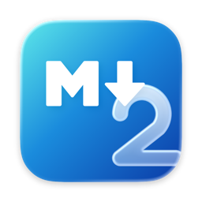
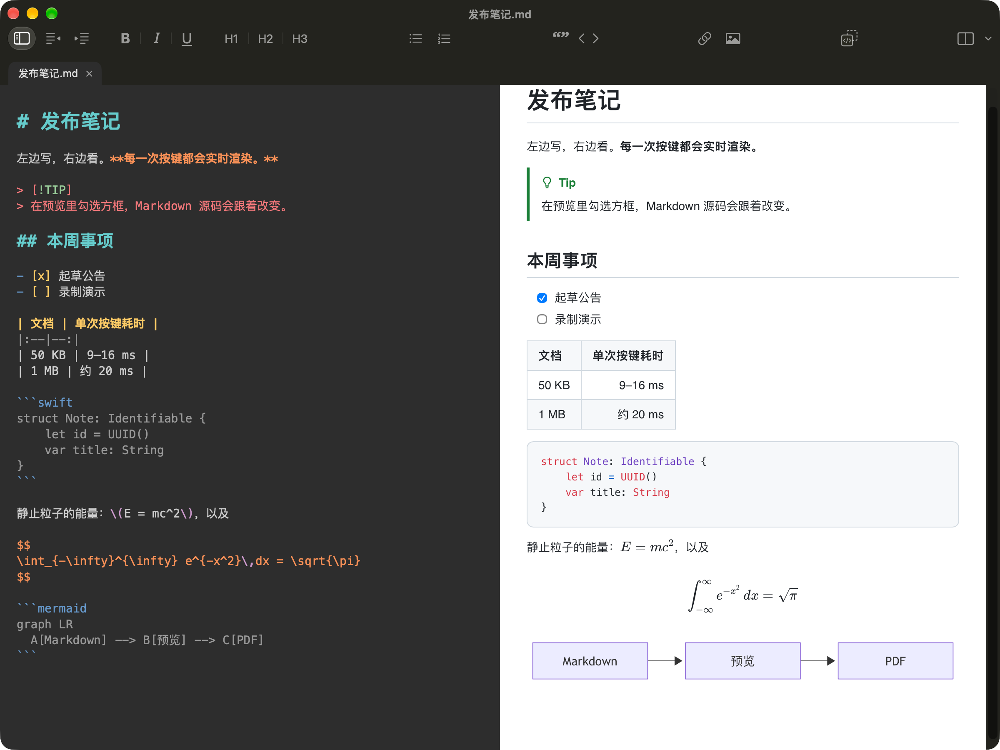
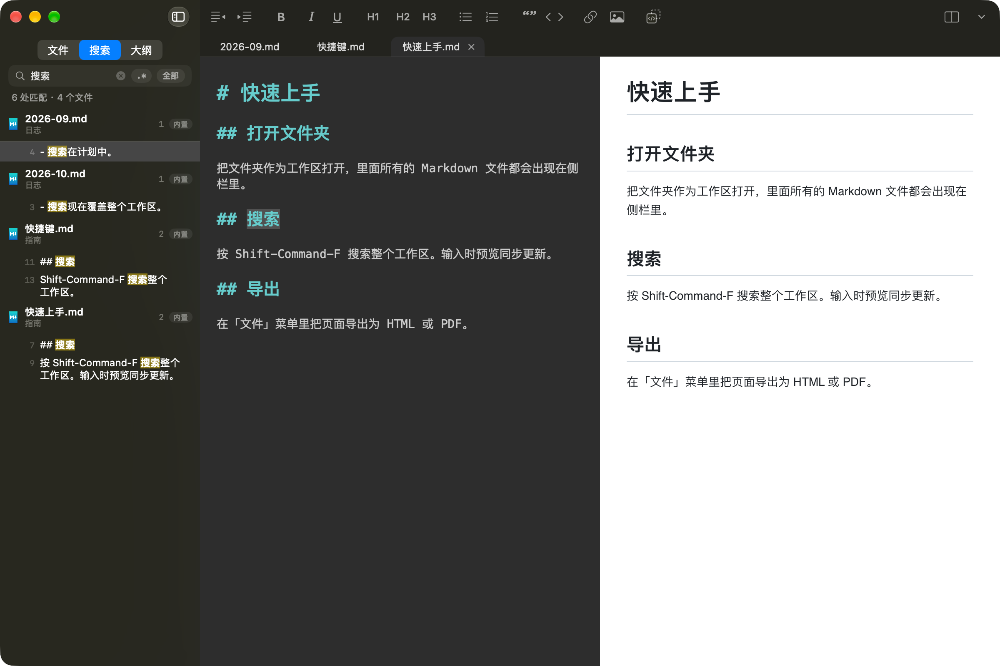

<p align="right"><a href="README.md">English</a> · <b>简体中文</b></p>

<p align="center">
  
</p>

<h1 align="center">MacDown2.0</h1>

<p align="center"><strong>Markdown，回归 Mac 原生。从零重写。</strong></p>

<p align="center">
  <a href="LICENSE"></a>
  
  
  
</p>

<p align="center">
  
</p>

<p align="center"><sub>默认外观：深色编辑区旁边一页白纸。GitHub 提示块、任务列表、表格、Swift 高亮、KaTeX 公式和 Mermaid 图表都在实时渲染。</sub></p>

## 为什么是 MacDown2.0

十多年前，Mou（Chen Luo）定下了 Mac 上写 Markdown 的样子：左边写源码，右边看预览，中间什么都不挡。MacDown（Tzu-ping Chung）把这个样子以开源的方式延续下来，成了一代 Mac 用户顺手就打开的那个 Markdown 编辑器。MacDown2.0 是它们的精神续作——同样的两栏，同样的快捷键肌肉记忆，同样不做所见即所得，也不想变成笔记应用。

它同时也是一次彻底的告别。没有移植任何旧代码：MacDown2.0 从一个空文件开始，用 Swift 6 和 SwiftUI 写成，只面向 macOS 26（Apple Silicon 与 Intel），底下是 Liquid Glass、TextKit 2、tree-sitter 和 markdown-it。没有兼容层，没有从上个十年留下来的框架，只有一个 Markdown 编辑器在今天的 Mac 上本该有的手感。

留下来的，是真正重要的那部分：深色编辑区旁边一页白纸，手指早已记住的快捷键，以及克制——它始终只是一个 Markdown 编辑器。

## 亮点

| | |
|:--|:--|
| **编辑** | TextKit 2 加 tree-sitter 增量语法高亮，沿用原版 MacDown 的样子：深色的 Tomorrow Night Eighties 编辑区、Menlo 14、标题栏里一排扁平工具栏（设置里可切回原版的居中标题加下方工具栏），编辑区与预览之间的分隔线和状态栏可选。工具栏和快捷键与 MacDown 一致：⌘B / ⌘I / ⌘U，⌘1–⌘6 标题，⌘K 行内代码，⇧⌘K 链接，⇧⌘B 引用，⌘/ 注释。自动配对、列表续写、Tab 缩进。中文输入法组字时不会被打断。 |
| **工作区** | 打开文件夹（⇧⌘O），里面的文件以树状出现在侧栏；不开文件夹时，浏览模式列出收藏、当前位置和最近使用。编辑区上方是标签页：单击文件在预览标签里查看，双击或第一次编辑即固定成正式标签。**内置全文搜索**（⇧⌘F，可开正则）覆盖整个工作区，大纲列出文档的各级标题。⌘N 新建未命名文档。 |
| **预览** | markdown-it 渲染，只更新改动过的块：50KB 文档单次按键 9–16ms，1MB 文档一次 patch 约 20ms。编辑区与预览双向滚动同步。**在预览里勾选任务框，Markdown 源码会随之改写。** |
| **语法** | GFM 表格与删除线、任务列表、脚注、GitHub 提示块（`> [!NOTE]`）、`==高亮==`、`H~2~O` 下标与 `x^2^` 上标、`[TOC]`、emoji 短码（`:smile:`，默认关闭），以及 YAML 或 TOML（`+++`，Hugo 风格）front matter，可隐藏或显示为表格。强调对中文友好：`**「重点」**的` 也能正确加粗。 |
| **公式、代码与图表** | KaTeX 支持 `$$…$$`、`\[…\]`、`\(…\)`，行内 `$…$` 可选开启。代码块由 highlight.js 高亮。Mermaid 图表（dagre 布局）在预览、PDF 和打印里绘制；HTML 导出、复制和 Quick Look 里保留为代码块。 |
| **磁盘上的文件** | 别的程序改了文件，会自动重新载入；有未保存修改时由你选「保留我的版本」或「从磁盘重新载入」，文件被删除会有标记。可读写 UTF-8、UTF-16、GB18030、Shift_JIS、Windows-1252 和 Mac Roman（**文件 › 编码**），LF、CRLF、CR 保持原样，遇到所选编码装不下的文字会拒绝保存，而不是悄悄丢字。 |
| **主题** | 编辑器 7 套（默认 MacDown Classic）、预览 8 套，各自独立选择；也可以都跟随系统深浅色。 |
| **导出** | 单文件 HTML（可内嵌图片）、按纸张分页的 PDF（纸张、方向、页边距在「设置 › 导出」，「格式 › 插入分页符」）、带专用打印样式的打印、复制为 HTML。单独一行的 `\newpage` 另起一页。 |
| **默认安全** | 导出和复制出去的 HTML 经过净化：不带文档里的脚本、框架和事件处理属性。预览里的链接：Markdown 文件在应用内打开，网页和邮件链接交给浏览器，其他文件先询问再交给系统，可执行文件一律不打开。可在「设置 › 渲染」里阻止远程图片；Quick Look 从不联网。 |
| **Quick Look** | 在 Finder 里按空格，直接看到渲染后的效果。 |
| **Quarto** | `.qmd` 支持以内置扩展的形式提供，默认开启。近似预览 callout、`:::` 分块、交叉引用、文献引用、shortcode 和 ``；代码单元只高亮，不执行。 |
| **还有** | 命令行工具（见下）；Dock 图标样式可选（跟随系统、浅色、深色、透明、着色）；中英文双语界面，可按应用单独设置语言；新窗口的默认布局；设置窗口；以及 Sparkle 自动更新——等正式发版后启用。通用二进制，同时支持 Apple Silicon 与 Intel。 |

<p align="center">
  
</p>

<p align="center"><sub>把文件夹当作工作区：侧栏全文搜索，编辑区上方是标签页。</sub></p>

## 安装

MacDown2.0 还没有发布正式版本。发版后将提供两种方式：

```sh
brew install --cask xuanji86/tap/macdown2    # 即将推出
```

或从 [GitHub Releases](https://github.com/xuanji86/MacDown2.0/releases) 下载 `.dmg`。

应用只做了 ad-hoc 签名、未经公证，而 Homebrew 官方的 `homebrew/cask` 不收未公证的应用，所以用项目自己的 tap，它安装后会顺便清掉隔离标记。手动下载的话，第一次打开 macOS 会拒绝：到「系统设置 › 隐私与安全性」里点「仍要打开」即可，之后的更新由 Sparkle 接手。

在首个版本发布之前，可以自己构建，一条命令的事。

## 命令行

应用自带 `macdown2` 命令。在应用菜单里点「MacDown2.0 › 安装命令行工具…」即可（不需要管理员权限，会链接到 `/opt/homebrew/bin` 或 `~/.local/bin`）；用 Homebrew cask 安装时会自动装好。

```sh
macdown2 notes.md docs/      # 打开文件；传文件夹则以工作区方式打开
macdown2 .                   # 把当前文件夹作为工作区打开
cat draft.md | macdown2      # 管道输入会存到 ~/Library/Caches/io.github.xuanji86.MacDown2/stdin/ 再打开
macdown2 --preview-only a.md # 只显示预览地打开（另有 --editor-only、--both）
macdown2 render a.md --standalone -o a.html    # 不启动应用，直接渲染 HTML
macdown2 render a.md --export pdf -o a.pdf --css my.css   # 同样不启动应用，直接出分页 PDF（也可 --export html）
macdown2 --help
```

`--both`、`--editor-only`、`--preview-only` 指定文件所在窗口的布局，应用是否已在运行都有效（最多给一个，且需要同时给文件或文件夹）。不带参数时，新窗口使用「设置 › 编辑器 › 布局」里的启动布局，重新打开的文件夹恢复它上次的布局，恢复的窗口沿用自己的布局。`--dry-run` 只打印将要执行的 `open` 命令，不真正运行。

`render --export pdf` 使用「设置 › 导出」里的纸张、方向和页边距，在 `macdown2` 进程内用一个看不见的 WebKit 视图打印：没有应用窗口，也没有 Dock 图标。它需要已登录的 macOS 会话（纯 `ssh` 或 launchd 守护进程里不行），并且必须带 `-o`（PDF 不往终端输出）。`--css file.css` 把你的样式表加在预览样式之后，只读取这一个本地文件（URL 或其中的 `@import` 会被拒绝）。`--embed-images` 把文档相对路径的图片嵌入 HTML。单独一行的 `\newpage`、`` 或 `<div style="page-break-after: always"></div>` 在 PDF 和打印里另起一页（预览里是一条虚线）。

退出码：0 成功，64 参数错误，66 文件问题，69 应用无法启动（或当前构建不能输出 PDF），70 渲染失败。

## 从源码构建

需要 macOS 26（Apple Silicon 或 Intel）和 Xcode 27。只有在修改 `Web/` 下的 JavaScript 渲染器时才需要 Node.js 23.6+。

```sh
git clone https://github.com/xuanji86/MacDown2.0.git
cd MacDown2.0
make test    # JS 测试、资源漂移与模块边界检查、Swift 包测试
make app     # Debug 构建 → build/DerivedData/Build/Products/Debug/MacDown2.app
make web     # 仅在改过 Web/ 之后：重新生成已提交的 web 资源
```

## 路线图

**计划中**

- 在预览区直接做文字级编辑，选区在两栏之间双向跟随
- 调用本机安装的 `quarto` 做真正的 Quarto 渲染
- 本地语义搜索，作为基于 [tobi/qmd](https://github.com/tobi/qmd) 的扩展
- 1.0

## 无隶属关系声明

MacDown2.0 是一个独立项目，与 [MacDown](https://github.com/MacDownApp/macdown) 和 [MacDown 3000](https://github.com/schuyler/macdown3000) 没有隶属关系，没有得到它们的认可，也不是它们的延续；没有使用它们的任何代码。「精神续作」说的是理念与使用体验上的传承，而不是官方意义上的继任。

## 致谢

- Mou 与 [MacDown](https://macdown.uranusjr.com)，定义了这件事该有的样子
- [MacDown 3000](https://github.com/schuyler/macdown3000)，我们的渲染快照测试使用了它的测试文档（MIT）
- Dustin Curtis 的 [Markdown Mark](https://github.com/dcurtis/markdown-mark)（CC0）；图标中的 M↓ 字形按其网格重绘
- [markdown-it](https://github.com/markdown-it/markdown-it)、[@mdit](https://mdit-plugins.github.io) 插件（含提示块）与 [markdown-it-emoji](https://github.com/markdown-it/markdown-it-emoji)；[KaTeX](https://katex.org)、[highlight.js](https://highlightjs.org)
- [Mermaid](https://mermaid.js.org) 及其 dagre 布局
- [parse5](https://github.com/inikulin/parse5)（HTML 净化器的基础）与 [smol-toml](https://github.com/squirrelchat/smol-toml)（TOML front matter）
- Chris Kempson 的 Tomorrow Night Eighties 配色（MIT），MacDown Classic 编辑器主题的基础
- [tree-sitter](https://tree-sitter.github.io) 与 [tree-sitter-markdown](https://github.com/tree-sitter-grammars/tree-sitter-markdown)；ChimeHQ 的 [SwiftTreeSitter](https://github.com/ChimeHQ/SwiftTreeSitter) 与 [Neon](https://github.com/ChimeHQ/Neon)
- [Sparkle](https://sparkle-project.org)
- [quarto-dev/quarto](https://github.com/quarto-dev/quarto) 的 markdown-it 插件

完整许可文本随 App 附带，见 `THIRD_PARTY_LICENSES.txt`。

## 许可

[GPL-3.0](LICENSE)。每个发布版本都附带构建它时所用的完整源码。
